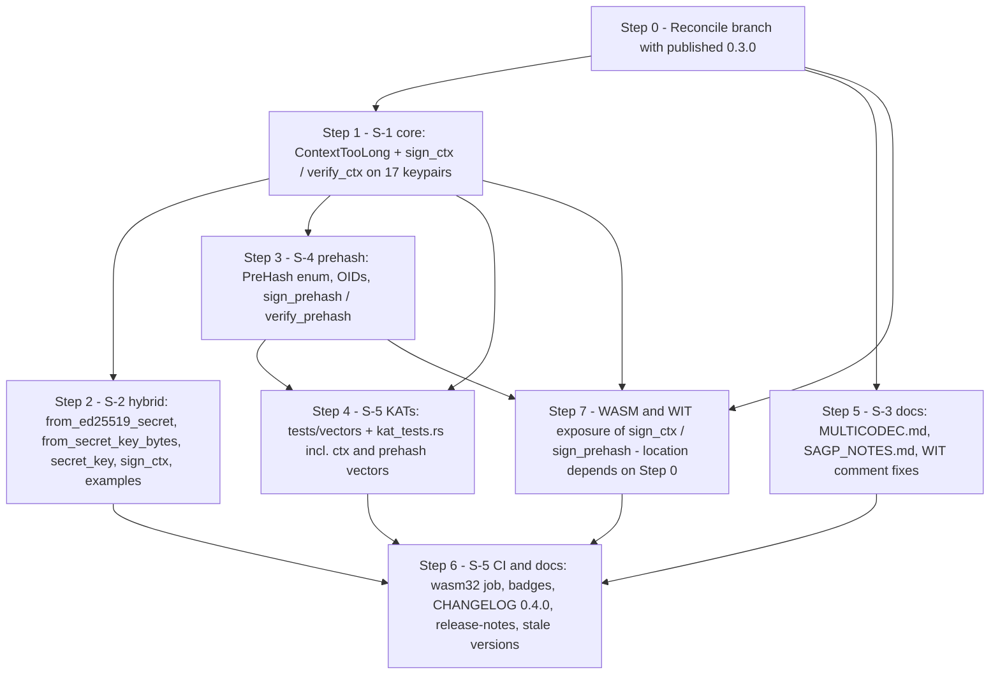

# pqc-sig — Gap Analysis Validation Report (Phase 1)

**Scope:** Verify stakeholder-claimed gaps S-1..S-5 against the actual `pqc-sig` codebase and
produce the implementation spec for the subsequent Code-mode phase.

**Validated against:** working tree at `d:/Github/0x307/__pqc-and-privacy__/pqc-sig`, git
branch `features-hk1` (HEAD `75789f5`), plus the *published* `pqc-sig 0.3.0` crate as
extracted in the local cargo registry (`~/.cargo/registry/src/index.crates.io-*/pqc-sig-0.3.0/`,
cut from commit `c12664d`).

**Date:** 2026-09-09

---

## 1. Executive Summary

| ID | Claim | Verdict | One-line finding |
|----|-------|---------|------------------|
| S-1 | No domain-separated `sign(ctx, msg)` | **CONFIRMED** | Every wrapper hard-codes an empty FIPS `ctx` (`try_sign`, `try_sign_with_context(msg, &[], ..)`, `DOMAIN_NONE`). All three upstream crates natively support `ctx`; the wrapper hides it. |
| S-2 | Hybrid feature-gated, easy to skip, no one-liner | **PARTIALLY CONFIRMED** | Hybrid is correctly off-by-default. No `examples/` directory exists; no SAGP text exists in-repo. The real migration blocker is that `HybridSigner` cannot be built from an *existing* Ed25519 key nor persisted (no `secret_key()`/`from_*` constructors). |
| S-3 | FN-DSA uses a private multicodec | **PARTIALLY CONFIRMED (tree-dependent)** | Working tree: FN-DSA has **no** multicodec code (`Err`). Published 0.3.0: provisional private-use codes `0x307000`/`0x307001`. Nothing makes FN-DSA a default, but `COMPACT_ALGORITHM` and the README selection guide recommend FN-DSA-512 for "compact signatures". |
| S-4 | No streaming / prehash API | **CONFIRMED** | Zero prehash/streaming surface. `ml-dsa 0.1.1` and `slh-dsa 0.2.0-rc.5` do **not** implement `HashML-DSA`/`HashSLH-DSA`; both expose the `*_internal` primitives needed to build them. `fn-dsa` supports pre-hashed messages natively. |
| S-5 | v0.3, little external proof | **PARTIALLY CONFIRMED** | CHANGELOG and MSRV **already exist**. No wasm32/wasm-pack CI job or badge, no crates.io/docs.rs badges, and **zero known-answer tests** — the KAT gap is fully confirmed. |

### Critical pre-condition discovered (not in the stakeholder list)

**The working tree is behind the published crate.** crates.io has `pqc-sig 0.3.0`
(2026-09-02, commit `c12664d`) which, per its CHANGELOG:

- **removed** the `wasm` feature and `src/wasm.rs` (moved to a sibling `pqc-sig-wasm` crate,
  `publish = false`), narrowed `crate-type` to `["rlib"]`;
- **added** provisional FN-DSA multicodec codes `0x307000`/`0x307001` and
  `SigAlgorithm::is_private_use_multicodec()`;
- added CI jobs `pqc-sig-wasm (wasm32 cdylib artifact)` and `Downstream consumer (no_std ...)`.

None of this is present on `features-hk1` (working tree is `0.2.1`, still has `src/wasm.rs`,
still returns `Err` for FN-DSA multicodec). Commit `c12664d` is not the head of any local
branch (`main` = `0ef6f97`, `sagp-integration` = `0e7153c`, `features-hk1` = `75789f5`).
**Code mode must reconcile the branch with 0.3.0 before implementing anything** — see §8
step 0. All WASM/WIT recommendations below are written for *both* outcomes.

---

## 2. Codebase Facts

### 2.1 Version

| Source | Version |
|--------|---------|
| Working tree [`Cargo.toml:3`](../Cargo.toml:3) | `0.2.1` |
| [`README.md:58`](../README.md:58) release table / [`CHANGELOG.md:10`](../CHANGELOG.md:10) | v0.2.1 (2026-09-01) latest |
| Published on crates.io (local registry copy) | `0.3.0` (2026-09-02) |
| [`wit/pqc-sig.wit:12`](../wit/pqc-sig.wit:12) package | `x307:pqc-sig@0.1.0` (stale) |
| [`build.ps1:49`](../build.ps1:49) `dist/package.json` | `"version": "0.1.0"` (stale) |
| [`README.md:226`](../README.md:226) JS example | `// "0.1.0"` (stale) |

### 2.2 Declared cargo features ([`Cargo.toml:68-92`](../Cargo.toml:68))

```toml
default = ["std"]
std     = ["serde/std", "serde_json/std", "zeroize/std"]
wasm    = ["dep:wasm-bindgen", "dep:js-sys", "dep:getrandom", "getrandom/js", "rand_core/getrandom", "std"]
fndsa   = ["dep:fn-dsa"]
hybrid  = ["dep:ed25519-dalek"]
```

Published 0.3.0 has only `default`, `std`, `fndsa`, `hybrid` (`wasm` removed).

### 2.3 Dependencies (declared → locked)

| Crate | Declared | Locked | Notes |
|-------|----------|--------|-------|
| `ml-dsa` | `0.1.1`, no default features, `["alloc","rand_core"]` | 0.1.1 | RustCrypto; internally `signature 3.0.0`, `rand_core 0.10.1` |
| `slh-dsa` | `0.2.0-rc.5`, `["alloc"]` | 0.2.0-rc.5 | RustCrypto; **release candidate** |
| `fn-dsa` | `0.4`, optional | 0.4.0 (+ `fn-dsa-comm/kgen/sign/vrfy` 0.4.0) | Source not extracted locally; API verified via wrapper usage only |
| `ed25519-dalek` | `2`, optional, `["alloc","zeroize","rand_core"]` | 2.2.0 (`curve25519-dalek` 4.1.3) | |
| `rand_core` | `0.6` | 0.6.4 **and** 0.10.1 | Two majors in graph — see §3 risk |
| `wasm-bindgen` / `js-sys` / `getrandom` | `0.2` / `0.3` / `0.2`, optional | 0.2.127 / — / 0.2.17 | |
| `pkcs8`/`der`/`spki` | 0.11 / 0.8 / 0.8 | | forced-alloc for slh-dsa |
| dev: `rand 0.8`, `hex 0.4`, `ssi-multicodec 0.2`, `multibase 0.9` | | | |

### 2.4 MSRV

- Declared `rust-version = "1.85"` at [`Cargo.toml:5`](../Cargo.toml:5).
- Enforced by CI job `msrv` (build-only, default + all-features, pinned
  `dtolnay/rust-toolchain@1.85.0`) at [`.github/workflows/ci.yml:188-223`](../.github/workflows/ci.yml:188).
- Documented at [`README.md:89-101`](../README.md:89) (driver: `block-buffer` via `slh-dsa`
  needs `edition2024`; promise covers build/check, not test).
- Raising MSRV is breaking per [`STABILITY.md:35`](../STABILITY.md:35).

### 2.5 CI (working tree)

[`.github/workflows/ci.yml`](../.github/workflows/ci.yml): push to `main` + all PRs, no
caching (deliberate). Jobs: `default`, `all-features`, `packaged-default`,
`packaged-all-features`, `msrv`, `clone-to-green` (reporting).
[`.github/workflows/cargo-deny.yml`](../.github/workflows/cargo-deny.yml): matrix
advisories/bans/licenses/sources; push/PR/weekly; header comment (lines 3-9) is **stale** —
says it is "EXPECTED to fail" on PQClean advisories which 0.2.0 resolved.

**Absent:** any `wasm32-unknown-unknown` build, `wasm-pack`, `test-wasm.mjs`, clippy,
rustfmt, `cargo doc`. **Badges** ([`README.md:5-10`](../README.md:5)): CI, cargo-deny,
license, FIPS 204/205/206. **Absent:** crates.io, docs.rs, MSRV, wasm.

### 2.6 Documentation conventions to match

- **CHANGELOG.md** — Keep a Changelog 1.1.0. `## [x.y.z] - YYYY-MM-DD`; `### Added` /
  `### Changed` / `### Fixed`; breaking items `**BREAKING:**` with old→new signature and
  migration note ([`STABILITY.md:71-78`](../STABILITY.md:71)). Published 0.3.0 adds a
  `### Migration from 0.2.x` subsection — reuse for the next breaking release. Long-form prose,
  ~95-col wrap, backticked identifiers, explains *why*.
- **release-notes.md** — `## vX.Y.Z (YYYY-MM-DD)`, `### <Category>: <headline>` subsections,
  `### Test Coverage` with counts per feature combo.
- **README.md** — "What runs today vs. what is designed", release table, algorithm table,
  feature table, selection guide. README is `include_str!`-ed into lib.rs, so feature-gated
  examples must be `rust,ignore` ([`README.md:239-243`](../README.md:239)).
- **STABILITY.md** — adding methods/features is non-breaking; changing defaults or tightening
  validation is breaking; ambiguous → breaking.

### 2.7 Test inventory

Integration tests exist for all algorithms with random keys only. The **only committed
vectors** are 15 Multikey strings in [`tests/multibase_tests.rs:21-37`](../tests/multibase_tests.rs:21).
No `tests/vectors/`, `examples/`, or `benches/`. Grep `KAT|known-answer|ACVP|SAGP|8gentz` →
0 hits. [`test-wasm.mjs`](../test-wasm.mjs) exercises `dist/` but is not run in CI.

---

## 3. S-1 — Domain-separated `sign_ctx(purpose, msg)`

### Verdict: **CONFIRMED**

### Evidence

| Location | Finding |
|----------|---------|
| [`src/fips204/ml_dsa_65.rs:70-75`](../src/fips204/ml_dsa_65.rs:70) | `sign(rng, msg)`: `let _ = rng; self.signing_key.try_sign(message)`. `Signer::try_sign` is documented in `ml-dsa` as "only supports signing with an empty context string". **`rng` is ignored — `sign` is deterministic** although [`wit/pqc-sig.wit:110`](../wit/pqc-sig.wit:110) says "randomized (hedged)". |
| [`src/fips204/ml_dsa_65.rs:107`](../src/fips204/ml_dsa_65.rs:107) | `vk.verify(message, &sig)` — empty ctx. Same pattern in `ml_dsa_44.rs` / `ml_dsa_87.rs`. |
| [`src/fips205/slh_dsa_sha2_128s.rs:55`](../src/fips205/slh_dsa_sha2_128s.rs:55) (+11 siblings at line 43) | `try_sign_with_context(message, &[], Some(&opt_rand))` — the ctx API is already called with a hard-coded empty slice. |
| [`src/fips205/slh_dsa_sha2_128s.rs:62,79`](../src/fips205/slh_dsa_sha2_128s.rs:62) | `try_sign(message)` / `vk.verify(message, &sig)` — empty ctx. |
| [`src/fips206/fn_dsa_512.rs:60,81`](../src/fips206/fn_dsa_512.rs:60) | `&DOMAIN_NONE, &HASH_ID_RAW` hard-coded on sign and verify. |
| [`src/hybrid.rs:126-130`](../src/hybrid.rs:126) | No ctx on either half. |
| [`src/wasm.rs`](../src/wasm.rs), [`wit/pqc-sig.wit`](../wit/pqc-sig.wit) | All `sign`/`verify` take `(message)` only. |
| [`src/lib.rs:118`](../src/lib.rs:118) | `PRIMARY_ALGORITHM = "ML-DSA-65"` — as claimed. |

### Existing relevant upstream API (verified in registry sources)

**`ml-dsa 0.1.1`**
- `SigningKey<P>` has **no** ctx method; `SigningKey::expanded_key()` is `pub` but
  **`#[doc(hidden)]`** (`signing.rs:119-124`).
- `ExpandedSigningKey::sign_deterministic(&self, M: &[u8], ctx: &[u8]) -> Result<Signature<P>, Error>`
  (`signing.rs:428`; errors if `ctx.len() > 255`).
- `ExpandedSigningKey::sign_randomized<R: TryCryptoRng>(&self, M, ctx, rng)` (`signing.rs:377`)
  — needs **`rand_core 0.10` `TryCryptoRng`**, not the `rand_core 0.6` trait this crate accepts.
- `VerifyingKey::verify_with_context(&self, M, ctx, sigma) -> bool` (`verifying.rs:131`;
  `false` if ctx > 255).
- Encoding: μ = H(tr ‖ `0x00` ‖ len(ctx) ‖ ctx ‖ M) (`lib.rs:159-166`) — FIPS 204 Alg. 2.

**`slh-dsa 0.2.0-rc.5`**
- `SigningKey::try_sign_with_context(&self, msg, ctx, opt_rand: Option<&[u8]>) -> Result<Signature<P>, Error>`
  (`signing_key.rs:181`; `u8::try_from(ctx.len())` enforces ≤255; frames `0x00 ‖ len ‖ ctx ‖ msg`).
- `VerifyingKey::try_verify_with_context(&self, msg, ctx, sig) -> Result<(), Error>`
  (`verifying_key.rs:99`).

**`fn-dsa 0.4`** — `SigningKey::sign(rng, &DomainContext, &HashIdentifier, msg, &mut sig)`;
`DOMAIN_NONE` is the empty `DomainContext`. Code mode must confirm the `DomainContext`
constructor (expected tuple struct `DomainContext(&[u8])`) and its ≤255 limit — source not
available locally.

### Recommended implementation

**Decision: native FIPS `ctx`, not prefix concatenation.** (1) FIPS 204 §5.2 / 205 §10.2
framing `0x00 ‖ len ‖ ctx` interoperates with any conformant verifier; (2) `sign(ctx ‖ msg)` is
verifiable by plain `verify()` on an attacker-chosen "message", so it does not prevent the
cross-protocol confusion S-1 names; (3) upstream already implements and length-checks it.

**Error** — add to [`src/error.rs`](../src/error.rs) `SigError`:

```rust
/// FIPS 204/205/206 context string exceeds the 255-byte maximum.
#[error("context string too long: {len} bytes (max 255)")]
ContextTooLong { len: usize },
```

Check `ctx.len() <= 255` in the wrapper before calling upstream (upstream errors are opaque).

**Per-keypair methods** on all 17 keypair types (3 files in `src/fips204/`, 12 in
`src/fips205/`, 2 in `src/fips206/`), mirroring the existing `sign`/`sign_deterministic`/
`verify` trio with `ctx` inserted before `message`:

```rust
pub fn sign_ctx<R: CryptoRng + RngCore>(&self, rng: &mut R, ctx: &[u8], message: &[u8]) -> SigResult<Signature>;
pub fn sign_ctx_deterministic(&self, ctx: &[u8], message: &[u8]) -> SigResult<Signature>;   // ML-DSA + SLH-DSA only (FN-DSA is randomized)
pub fn verify_ctx(public_key: &SigPublicKey, ctx: &[u8], message: &[u8], signature: &Signature) -> SigResult<()>;
```

Implementation mapping:
- ML-DSA: `self.signing_key.expanded_key().sign_deterministic(message, ctx)`;
  `vk.verify_with_context(message, ctx, &sig)`. Keep `sign_ctx` deterministic (matching the
  current `sign`) and document it; see hedging risk below.
- SLH-DSA: `try_sign_with_context(message, ctx, Some(&opt_rand))` /
  `try_sign_with_context(message, ctx, None)`; `vk.try_verify_with_context(message, ctx, &sig)`.
- FN-DSA: `sk.sign(rng, &DomainContext(ctx), &HASH_ID_RAW, message, &mut sig)` and the
  verify mirror.
- Invariant to test: `sign_ctx(&[], m)` verifies under plain `verify(m)` and vice versa
  (empty ctx is byte-identical to the pure algorithm in all three standards).
- Reduce the 17-fold duplication with a `macro_rules!` inside `fips205/mod.rs` if desired; the
  codebase's current style is explicit per-file — either is acceptable.

**Hybrid** — see §4 (`HybridSigner::sign_ctx` / `verify_ctx`).

**Purpose strings** — do **not** bake `8gentz-agent-v1` / `8gentz-fabric-v1` into the crate's
public API (the crate is generic). Put them in `examples/domain_separation.rs` and the
README "Domain separation" section; SAGP owns the registry of purpose strings. Both fit
trivially (15/16 bytes ≤ 255).

**Convenience dispatcher (optional)** — a crate-level
`pub fn sign_ctx(sk: &SigSecretKey, ctx, msg, rng) -> SigResult<Signature>` /
`verify_ctx(pk, ctx, msg, sig)` in a new `src/dispatch.rs` matching on `SigAlgorithm` would
give the literal `sign_ctx(purpose, msg)` shape the stakeholder asked for; note FN-DSA
requires both pk and sk bytes to restore (`from_key_bytes(pk, sk)`,
[`src/fips206/fn_dsa_512.rs:89`](../src/fips206/fn_dsa_512.rs:89)), so a `SigSecretKey`-only
dispatcher cannot cover FN-DSA without an API change. Recommend deferring the dispatcher.

**WASM** ([`src/wasm.rs`](../src/wasm.rs) if retained, else `pqc-sig-wasm`): add
`sign_ctx(&self, ctx: &[u8], message: &[u8]) -> Result<Vec<u8>, JsValue>` to every
`Wasm*Keypair`, and free functions `<alg>_verify_ctx(pk, ctx, msg, sig) -> bool`.

**WIT** ([`wit/pqc-sig.wit`](../wit/pqc-sig.wit)): add `sign-ctx: func(ctx: list<u8>, message: list<u8>) -> result<list<u8>, sig-error>`
to both resources, `verify-ctx: func(params, public-key, ctx, message, signature) -> result<_, sig-error>`
to both interfaces, and `context-too-long(u32)` to `sig-error`. Bump package to
`x307:pqc-sig@0.4.0` (it is stale at 0.1.0 regardless).

**Feature gating:** none — ctx is core FIPS behaviour on all default algorithms.

### Tests to add

- `tests/ctx_tests.rs`: for ML-DSA-65, SLH-DSA-SHA2-128s, SLH-DSA-SHAKE-128f, FN-DSA-512
  (`cfg(fndsa)`): sign_ctx/verify_ctx round-trip; `verify_ctx` with wrong ctx → `VerificationFailed`;
  `verify` (no ctx) of a ctx-signed message → `VerificationFailed`; empty ctx ≡ plain;
  255-byte ctx OK; 256-byte ctx → `ContextTooLong { len: 256 }` on both sign and verify;
  the two SAGP purpose strings cross-reject (`agent` key signing `fabric` ctx is rejected under
  `agent` ctx).
- ACVP `sigVer`/`sigGen` vectors with non-empty `context` (see §7) — proves the framing matches
  FIPS, not just self-consistency.
- WASM: extend [`test-wasm.mjs`](../test-wasm.mjs) with one `sign_ctx`/`verify_ctx` case.

### Risks / constraints

- `ml-dsa`'s ctx path is reachable only via `#[doc(hidden)] expanded_key()`. It is `pub` and
  stable within 0.1.x, but pin `ml-dsa = "=0.1.1"` or rely on KATs (§7) to detect breakage.
- **Hedged ML-DSA is currently a documentation lie** (`let _ = rng`). Making `sign`/`sign_ctx`
  truly randomized requires a `rand_core 0.6 → 0.10` adapter (`TryCryptoRng`) or adding
  `rand_core = "0.10"` as a direct dependency. Deterministic ML-DSA is FIPS-permitted; fix the
  docs now ([`wit/pqc-sig.wit:110`](../wit/pqc-sig.wit:110), method doc comments) and track
  true hedging as a follow-up. Do not let it block S-1.
- Adding `sign_ctx` is non-breaking (STABILITY §2). Do **not** change the existing `sign`
  signature.

---

## 4. S-2 — Hybrid feature gating, `examples/hybrid_bridge.rs`, SAGP Wave-1 note

### Verdict: **PARTIALLY CONFIRMED**

### Evidence

| Location | Finding |
|----------|---------|
| [`Cargo.toml:92`](../Cargo.toml:92), [`src/lib.rs:79-80`](../src/lib.rs:79) | `hybrid = ["dep:ed25519-dalek"]`, `#[cfg(feature = "hybrid")] pub mod hybrid;` — off by default, as claimed. |
| Workspace file list | **No `examples/` directory exists** for any feature. |
| [`README.md:229-254`](../README.md:229) | Hybrid section with a `rust,ignore` example (not compiled). [`src/hybrid.rs:9-21`](../src/hybrid.rs:9) has a `no_run` doctest — the only compiled example. |
| grep `SAGP|8gentz` | 0 hits — no SAGP language anywhere in the repo. |
| [`src/hybrid.rs:109-164`](../src/hybrid.rs:109) | `HybridSigner` API is **`generate` / `public_key` / `sign` / `verify` only**. There is no `secret_key()`, no `from_secret_key_bytes`, no way to wrap an *existing* Ed25519 identity, and no way to persist a signer across restarts. |
| [`src/hybrid.rs:128`](../src/hybrid.rs:128) | PQ half uses `sign_deterministic` — no ctx (ties to S-1). |
| [`README.md:38-39`](../README.md:38), [`wit/pqc-sig.wit`](../wit/pqc-sig.wit) | Hybrid has no WASM bindings and no WIT interface. |
| [`src/hybrid.rs:40`](../src/hybrid.rs:40) | `HYBRID_ALGORITHM = "ed25519+ml_dsa_65"` — no `SigAlgorithm` variant, no multicodec, so hybrid keys cannot be expressed as a `SigPublicKey`/Multikey. |

### Existing relevant code

`ed25519-dalek 2.2.0` provides `SigningKey::from_bytes(&[u8; 32])`, `to_bytes()`, and
`Signer`. `MlDsa65Keypair::from_secret_key_bytes(&[u8; 32])` and `secret_key()` already exist
([`src/fips204/ml_dsa_65.rs:61-67,111-120`](../src/fips204/ml_dsa_65.rs:111)). Everything
needed for a "bridge an existing Ed25519 key" constructor is already in the dependency graph.

### Recommended implementation

**Feature gating:** keep `hybrid` off-by-default (confirmed correct; changing a default is
breaking per STABILITY §2). Do not add it to `default`.

**`src/hybrid.rs` additions** (the actual one-liner migrating agents need):

```rust
impl HybridSigner {
    /// Bridge an existing Ed25519 identity: keep the classical key, generate a fresh ML-DSA-65 half.
    pub fn from_ed25519_secret<R: CryptoRng + RngCore>(rng: &mut R, ed25519_secret: &[u8; 32]) -> SigResult<Self>;
    /// Restore from both halves (Ed25519 32-byte secret, ML-DSA-65 32-byte seed).
    pub fn from_secret_key_bytes(ed25519_secret: &[u8; 32], ml_dsa_seed: &[u8; 32]) -> SigResult<Self>;
    /// Export both halves for persistence.
    pub fn secret_key(&self) -> HybridSecretKey;                 // new struct, Zeroize + ZeroizeOnDrop, Debug redacted
    /// Domain-separated variants (S-1 parity).
    pub fn sign_ctx(&self, ctx: &[u8], message: &[u8]) -> SigResult<HybridSignature>;
    pub fn verify_ctx(ctx: &[u8], message: &[u8], signature: &HybridSignature, public_key: &HybridPublicKey) -> SigResult<()>;
}
```

`sign_ctx` semantics (design decision, flag for owner sign-off): ML-DSA half uses native FIPS
ctx (`sign_ctx_deterministic`). Ed25519 has no ctx parameter (RFC 8032 Ed25519ctx is not
exposed by `ed25519-dalek` for pure Ed25519), so the Ed25519 half signs the **same framed
message FIPS 204 uses**: `0x00 ‖ u8(ctx.len()) ‖ ctx ‖ message`. This binds both halves to
ctx so a stripped classical half cannot be replayed as a plain Ed25519 signature over
`message`. Consequence: `sign_ctx(&[], m)` ≠ `sign(m)` on the Ed25519 half — document that
the two constructions are distinct and not interchangeable. Reject `ctx.len() > 255` with
`ContextTooLong`.

**`examples/hybrid_bridge.rs`** (`required-features = ["hybrid"]` in `Cargo.toml`
`[[example]]`): load/generate an Ed25519 key → `HybridSigner::from_ed25519_secret` →
`sign_ctx(b"8gentz-agent-v1", msg)` → `verify_ctx` → JSON round-trip → persist
`secret_key()`. Also add `examples/domain_separation.rs` (no feature) for S-1. Examples are
compiled by `cargo test`/`cargo build --examples`, so add `cargo build --examples --all-features`
to the `all-features` CI job.

**SAGP note:** no SAGP document lives in this repo. Add a `docs/SAGP_NOTES.md` (or a README
subsection "SAGP guidance") stating: *Wave 1 verifiers MUST accept `ed25519+ml_dsa_65` hybrid
signatures alongside pure ML-DSA-65; hybrid is a migration bridge, not a long-term default;
Wave 2 drops the classical half.* The authoritative text belongs in the SAGP spec itself —
this repo should link to it, not own it.

**WASM/WIT:** optional. If the WASM surface is retained/reinstated, add `WasmHybridSigner`
behind `wasm,hybrid` and a `hybrid` WIT interface; otherwise defer.

### Tests to add

- `src/hybrid.rs` unit tests: `from_ed25519_secret` reproduces the same Ed25519 verifying key;
  `from_secret_key_bytes` ↔ `secret_key()` round-trip; `sign_ctx`/`verify_ctx` pass;
  wrong ctx fails on **classical** side first (`HybridClassicalFailed`); stripped classical half
  does **not** verify as plain Ed25519 over `message` (proves the framing); ctx > 255 rejected.
- `examples/hybrid_bridge.rs` compiled in CI.

### Risks / constraints

- `HybridSecretKey` must be `ZeroizeOnDrop` and redacted `Debug` like
  [`SigSecretKey`](../src/types.rs:351).
- Hybrid signatures have no `SigAlgorithm` variant / multicodec, so they cannot ride the
  `Signature`/`SigPublicKey`/Multikey path. Acceptable for a bridge; note in docs.
- `ed25519-dalek` and `curve25519-dalek` contain `unsafe` (already disclosed at
  [`README.md:103-113`](../README.md:103)).

---

## 5. S-3 — FN-DSA private multicodec

### Verdict: **PARTIALLY CONFIRMED — depends on which tree is authoritative**

### Evidence

| Location | Finding |
|----------|---------|
| Working tree [`src/types.rs:190-214`](../src/types.rs:190) | `multicodec_code()` returns `Err(InvalidPublicKey("... has no registered multicodec code ..."))` for `FnDsa512`/`FnDsa1024`. **No private code exists here.** |
| Working tree [`tests/multibase_tests.rs:85-90`](../tests/multibase_tests.rs:85), [`README.md:32-36,47-48`](../README.md:32), [`release-notes.md:25-27`](../release-notes.md:25) | All assert/document that FN-DSA Multikey is *unsupported*. |
| Published 0.3.0 `src/types.rs:193-227` + `FN_DSA_PRIVATE_USE_BASE` doc (lines 229-270) | `FnDsa512 => Ok(0x307000)`, `FnDsa1024 => Ok(0x307001)`; `is_private_use_multicodec()`; long rationale: "reserve and don't block upstream", scope "0x307-controlled systems only", revisit trigger = upstream registration. Its CHANGELOG calls the codes **provisional**. |
| [`src/lib.rs:126-127`](../src/lib.rs:126) | `COMPACT_ALGORITHM = "FN-DSA-512"` — a named role constant, not a default. |
| [`README.md:325`](../README.md:325) | Selection guide: "Compact signatures → FN-DSA-512". |
| [`src/lib.rs:117-118`](../src/lib.rs:117), [`src/wasm.rs:662-666`](../src/wasm.rs:662) | `PRIMARY_ALGORITHM = "ML-DSA-65"` is the only "primary"; nothing defaults to FN-DSA. |
| [`wit/pqc-sig.wit:48-51`](../wit/pqc-sig.wit:48) | FN-DSA enum comments say "NOT WASM-compatible" — **stale** since 0.2.0 (README:84 says WASM-compatible). |
| [`README.md:10`](../README.md:10), [`README.md:85`](../README.md:85) | FIPS 206 correctly flagged as **draft (ipd)**. |

### Existing relevant code

Multikey encode/decode ([`src/types.rs:217-334`](../src/types.rs:217)) is generic over the
code; the only FN-DSA-specific logic is the `match` arm. 0.3.0 already shipped the private-use
codes plus `is_private_use_multicodec()` and updated `tests/multibase_tests.rs` /
`tests/ssi_interop_test.rs`.

### Recommended implementation

The stakeholder's three asks are all **policy/documentation**, and the code half was already
published in 0.3.0. Code-mode work:

1. **Reconcile with 0.3.0 first** (§8 step 0). Do not re-implement private codes on
   `features-hk1`; take 0.3.0's `FN_DSA_PRIVATE_USE_BASE`, `is_private_use_multicodec()`, and
   its tests verbatim.
2. **Do not default FN-DSA.** No code change needed — assert it in docs: add to README's
   selection guide row for FN-DSA-512: *"opt-in (`fndsa`); FIPS 206 is a draft; Multikey codes
   are provisional 0x307-private — never the SAGP default."* Add the same sentence to the
   `docs/SAGP_NOTES.md` from §4. Consider renaming/deprecating nothing — `COMPACT_ALGORITHM` is
   fine as a role label.
3. **Document provisional codes** in one discoverable place: new `docs/MULTICODEC.md` with
   the full code table (`0x1210`-`0x1212`, `0x1220`-`0x122b`, `0x307000`-`0x307001`), status
   column (draft-registered vs private-use), interop scope, and the upstream revisit trigger
   (link to multiformats/multicodec `table.csv`). Link from README.
4. **Wait for upstream:** open (or link) a tracking issue "Register FN-DSA-512/1024 in
   multiformats/multicodec; migrate from 0x307000/0x307001" and reference it from the
   `FN_DSA_PRIVATE_USE_BASE` doc comment. Note in STABILITY terms that switching codes later is
   a wire-format break (STABILITY §2) — plan it as a `0.x` minor with `from_multibase` accepting
   both codes for one deprecation cycle.
5. Fix the stale WIT comments at [`wit/pqc-sig.wit:48-51`](../wit/pqc-sig.wit:48).
6. If a WASM utils surface exists, expose `is_private_use_multicodec(algorithm: &str) -> bool`.

### Tests to add

Already present in 0.3.0 (round-trip, cross-variant rejection, no-collision with registered
codes, independent-decoder structural validity). Add one assertion that
`is_private_use_multicodec()` is `false` for all 15 ML-DSA/SLH-DSA variants and `true` for
both FN-DSA variants (guards the invariant when new algorithms are added).

### Risks / constraints

- `0x307000` is *inside* the multicodec table's reserved private-use range
  (`0x300000`-`0x3fffff`) by coincidence of the org's name; 0.3.0's own doc comment says this
  was not byte-for-byte re-verified. Re-verify against the live `table.csv` before any
  non-0x307 consumer sees these codes.
- Choosing a private code is a wire-format commitment; every FN-DSA Multikey emitted now must
  be re-encoded when an upstream code lands.
- Working tree vs 0.3.0 divergence: implementing anything FN-DSA-multicodec-related on the
  current tree without first merging 0.3.0 will produce a second, incompatible history.

---

## 6. S-4 — Streaming / prehash API (`sign_prehash`)

### Verdict: **CONFIRMED**

### Evidence

| Location | Finding |
|----------|---------|
| All 17 `sign*`/`verify` methods | Take the full `message: &[u8]`; nothing accepts a digest, a `Digest` object, or chunks. |
| grep `prehash|pre_hash|pre-hash|HashML-DSA|HashSLH-DSA|Digest` in `src/`, `tests/`, docs | 0 hits. |
| [`src/fips206/fn_dsa_512.rs:20,60,81`](../src/fips206/fn_dsa_512.rs:20) | `HASH_ID_RAW` hard-coded — the pre-hash hook exists upstream and is pinned to "raw". |
| [`src/lib.rs:123-124`](../src/lib.rs:123), [`README.md:324`](../README.md:324) | `WASM_INTEGRITY_ALGORITHM = "SLH-DSA-SHA2-128s"` for "WASM module integrity" — the exact large-module use case S-4 describes, with no prehash path. |
| [`tests/ml_dsa_tests.rs:194-201`](../tests/ml_dsa_tests.rs:194) | Largest tested message is 64 KB, passed as one slice. |

### Existing relevant upstream API

**`ml-dsa 0.1.1`** — **no `HashML-DSA` (FIPS 204 Alg. 4/5)**. Available:
- `ExpandedSigningKey::sign_internal(&self, Mp: &[&[u8]], rnd: &B32) -> Signature<P>`
  (`signing.rs:308`; `pub`, comment "TODO(RLB) Only expose based on a feature") — raw
  `ML-DSA.Sign_internal` over a caller-framed `M'`, multipart.
- `VerifyingKey::verify_internal(&self, M: &[u8], sigma) -> bool` (`verifying.rs:98`) — raw
  `ML-DSA.Verify_internal`, no domain separator.
- External-μ API: `VerifyingKey::compute_mu(Mp: FnOnce(&mut Shake256), ctx) -> B64`
  (`verifying.rs:84`), `ExpandedSigningKey::sign_mu_deterministic(&mu)` (`signing.rs:435`),
  `VerifyingKey::verify_mu(&mu, sig)` (`verifying.rs:136`), plus `DigestSigner<Shake256>` /
  `MultipartSigner<&[&[u8]]>`. **This is true streaming for *pure* ML-DSA** (μ is a SHAKE256
  over `tr ‖ 0x00 ‖ len ‖ ctx ‖ M`, absorbable in chunks). `compute_mu` always prepends the
  `0x00` pure-mode byte, so it cannot build HashML-DSA.

**`slh-dsa 0.2.0-rc.5`** — **no `HashSLH-DSA` (FIPS 205 Alg. 23/25)**. Available:
- `SigningKey::slh_sign_internal(&self, msg: &[&[u8]], opt_rand: Option<&[u8]>) -> Signature<P>`
  (`signing_key.rs:146`; `pub`, `#[doc(hidden)]`, "published for KAT validation").
- `VerifyingKey::slh_verify_internal(..)` (`verifying_key.rs:66`).
- **No streaming is possible for SLH-DSA by construction**: the message is consumed twice
  (`PRF_msg` and `H_msg`, `signing_key.rs:160-162`). Only pre-hashing solves large inputs.

**`fn-dsa 0.4`** — native pre-hash support via `HashIdentifier` (`HASH_ID_RAW` today; the
crate also defines identifiers for SHA-256/384/512, SHA3-256/384/512, SHAKE128/256 — Code mode
must confirm exact constant names from the fn-dsa docs). No wrapper work beyond exposing them.

### Recommended implementation

**Decision: implement the FIPS `HashML-DSA` / `HashSLH-DSA` construction with OID-encoded
hash identifiers — not a plain "sign the digest bytes" helper.**

Why not "sign the digest bytes": `sign(&digest)` is indistinguishable from a pure signature over
an arbitrary 32/48/64-byte message; a verifier cannot tell which was intended, and the two are
interchangeable — the confusion S-1 exists to prevent. Why not "ctx-only prehash" (pure
`sign_ctx(b"...-sha256-v1", digest)`): it works and needs no hidden API, but is not verifiable by
any `HashML-DSA` verifier and re-invents the OID field. The FIPS construction is the only one
that interoperates with other implementations (OpenSSL 3.5+, BoringSSL, liboqs) and is exactly
what "SLH-DSA module verify already needs".

Framing (FIPS 204 §5.4.1 / FIPS 205 §10.2.2): `M' = 0x01 ‖ u8(len(ctx)) ‖ ctx ‖ OID(H) ‖ PH_M`,
then `Sign_internal(sk, M', rnd)` / `Verify_internal(pk, M', σ)`.

**New module `src/prehash.rs`** (public, always compiled):

```rust
/// Approved pre-hash functions for HashML-DSA / HashSLH-DSA / FN-DSA pre-hashed mode.
#[derive(Debug, Clone, Copy, PartialEq, Eq, Hash, Serialize, Deserialize)]
#[serde(rename_all = "kebab-case")]
pub enum PreHash { Sha256, Sha384, Sha512, Sha3_256, Sha3_512, Shake128, Shake256 }

impl PreHash {
    /// DER-encoded OID (11 bytes), e.g. SHA-256 = 06 09 60 86 48 01 65 03 04 02 01.
    pub const fn oid_der(&self) -> &'static [u8];
    /// Expected digest length; SHAKE128 = 32, SHAKE256 = 64 per FIPS 204 §5.4.1.
    pub const fn digest_len(&self) -> usize;
    /// Collision strength in bits (SHA-256: 128, SHA-384: 192, SHA-512: 256, SHAKE256: 256 ...).
    pub const fn collision_strength_bits(&self) -> u32;
}

/// Build M' for the pre-hashed mode. Returns ContextTooLong / InvalidDigestLength.
pub(crate) fn frame_prehash(ctx: &[u8], hash: PreHash, digest: &[u8]) -> SigResult<Vec<u8>>;
```

**Error variants** — [`src/error.rs`](../src/error.rs):

```rust
#[error("digest length {got} does not match {hash:?} ({expected} bytes)")]
InvalidDigestLength { hash: PreHash, expected: usize, got: usize },
#[error("pre-hash {hash:?} ({strength} bits) is weaker than {algorithm} requires ({required} bits)")]
PreHashTooWeak { hash: PreHash, strength: u32, algorithm: &'static str, required: u32 },
```

**Per-keypair methods** (ML-DSA ×3, SLH-DSA ×12; FN-DSA ×2 via native `HashIdentifier`):

```rust
pub fn sign_prehash<R: CryptoRng + RngCore>(&self, rng: &mut R, ctx: &[u8], hash: PreHash, digest: &[u8]) -> SigResult<Signature>;
pub fn sign_prehash_deterministic(&self, ctx: &[u8], hash: PreHash, digest: &[u8]) -> SigResult<Signature>;   // ML-DSA + SLH-DSA
pub fn verify_prehash(public_key: &SigPublicKey, ctx: &[u8], hash: PreHash, digest: &[u8], signature: &Signature) -> SigResult<()>;
```

Mapping:
- ML-DSA: `frame_prehash` → `expanded_key().sign_internal(&[&m_prime], &rnd)` with
  `rnd = [0u8; 32]` (deterministic) or 32 fresh bytes from the caller's `rand_core 0.6` RNG
  (hedged — `sign_internal` takes `&B32`, so **this path gives real hedging without the
  rand_core 0.10 adapter**); verify via `vk.verify_internal(&m_prime, &sig)`.
- SLH-DSA: `frame_prehash` → `slh_sign_internal(&[&m_prime], Some(&opt_rand) | None)`;
  verify via `slh_verify_internal`.
- FN-DSA: pass `&DomainContext(ctx)`, `&HASH_ID_<hash>`, and `digest` directly — fn-dsa frames
  it per FIPS 206 draft.
- Enforce `hash.collision_strength_bits() >= λ(alg)`: ML-DSA-44 → 128, ML-DSA-65 → 192,
  ML-DSA-87 → 256 (FIPS 204 §5.4.1); SLH-DSA 128/192/256 families → 128/192/256
  (FIPS 205 §10.2.2). This means **SHA-256 is rejected for ML-DSA-65/87 and SLH-DSA-192/256**;
  recommend SHA-512 or SHAKE256 as the SAGP default for module integrity.
- The `sign_prehash` helper takes the **digest** — the caller hashes (host already does
  this ad hoc). Also add a convenience `pub fn hash_for(hash: PreHash, data: &[u8]) -> Vec<u8>`
  in `prehash.rs` **only if** `sha2`/`sha3` are made direct dependencies — both are already in
  the lock via `slh-dsa`/`ml-dsa` (`sha2 0.11.0`, `sha3 0.11.0`), so the cost is zero. Recommend
  adding them with `default-features = false` to keep the "caller hashes" story honest.

**Streaming (ML-DSA only, optional follow-up):** `MlDsa*Keypair::signer_stream(ctx)` returning a
`Shake256`-backed builder using `compute_mu` + `sign_mu_deterministic` / `verify_mu`. Pure
mode, FIPS-exact, no hidden API. Document that SLH-DSA cannot stream and must use
`sign_prehash`. Not required for S-4's stated use case.

**WASM/WIT:** `sign_prehash(&self, ctx, hash: &str, digest) -> Result<Vec<u8>, JsValue>` and
`<alg>_verify_prehash(pk, ctx, hash: &str, digest, sig) -> bool` (hash as kebab-case string);
WIT `enum pre-hash { sha-256, sha-384, sha-512, sha3-256, sha3-512, shake-128, shake-256 }`,
`sign-prehash: func(ctx, hash: pre-hash, digest) -> result<list<u8>, sig-error>`,
`verify-prehash`, and `invalid-digest-length(string)` / `pre-hash-too-weak(string)` in
`sig-error`.

**Feature gating:** none for the API. If `sha2`/`sha3` direct deps are added, they are
already unconditional transitive deps — no new feature needed.

### Tests to add

- `tests/prehash_tests.rs`: round-trip for each `PreHash` on ML-DSA-44 (all hashes),
  ML-DSA-65/87 (SHA-256 → `PreHashTooWeak`), SLH-DSA-SHA2-128s, SLH-DSA-SHAKE-256f,
  FN-DSA-512 (`cfg(fndsa)`); wrong digest length → `InvalidDigestLength`; prehash signature
  does **not** verify via `verify`/`verify_ctx` over the digest bytes (proves the `0x01`
  domain byte); ctx > 255 → `ContextTooLong`; 10 MB input hashed then signed.
- **ACVP KATs for HashML-DSA** (`ML-DSA-sigGen-FIPS204` with `preHash: "preHash"`,
  `hashAlg`, `context`) and HashSLH-DSA (`SLH-DSA-sigGen-FIPS205` pre-hash cases) — see §7.
  These are the only way to prove the OID/framing is FIPS-exact rather than self-consistent.
- OID unit test: `PreHash::Sha256.oid_der() == hex!("0609608648016503040201")`, etc.

### Risks / constraints

- Depends on `#[doc(hidden)]`/"TODO expose" upstream internals (`sign_internal`,
  `verify_internal`, `slh_sign_internal`, `slh_verify_internal`). Pin `ml-dsa = "=0.1.1"` and
  `slh-dsa = "=0.2.0-rc.5"` **or** guard with KATs; prefer both. When RustCrypto ships native
  HashML-DSA/HashSLH-DSA, swap the implementation behind the same signatures (non-breaking).
- `slh-dsa` is an **rc** release; a 0.2.0 final may rename these internals.
- FIPS 204 §5.4 is explicit that pre-hash mode is *not* interchangeable with pure mode;
  document that `sign_prehash` and `sign`/`sign_ctx` signatures are mutually non-verifiable.
- `digest` is caller-supplied: a malicious or buggy caller can pass a digest of nothing. This
  is inherent to every pre-hash API and must be stated in the docs.
- SHAKE128 as pre-hash gives only 128-bit collision strength (32-byte output) → ML-DSA-44 /
  SLH-DSA-128 only.

---

## 7. S-5 — Version 0.3, CHANGELOG, MSRV, wasm-pack CI badge, 100 published KATs

### Verdict: **PARTIALLY CONFIRMED**

| Sub-claim | Verdict | Evidence |
|-----------|---------|----------|
| "Version 0.3" | Partially true | Working tree `0.2.1` ([`Cargo.toml:3`](../Cargo.toml:3)); crates.io `0.3.0`. Stale `0.1.0` strings at [`wit/pqc-sig.wit:12`](../wit/pqc-sig.wit:12), [`build.ps1:49`](../build.ps1:49), [`README.md:226`](../README.md:226). |
| No CHANGELOG | **NOT CONFIRMED** | [`CHANGELOG.md`](../CHANGELOG.md) exists, Keep-a-Changelog format, three releases, migration notes. |
| No MSRV | **NOT CONFIRMED** | `rust-version = "1.85"` ([`Cargo.toml:5`](../Cargo.toml:5)), CI `msrv` job ([`ci.yml:188`](../.github/workflows/ci.yml:188)), README section ([`README.md:89`](../README.md:89)). No MSRV *badge*. |
| No wasm-pack CI badge | **CONFIRMED** | No wasm32 target, `wasm-pack`, or `test-wasm.mjs` step in either workflow; no badge. `build.ps1` is the only wasm-pack invocation and is Windows-only. |
| No published KATs | **CONFIRMED** | Zero known-answer tests; only 15 self-generated Multikey strings ([`tests/multibase_tests.rs:21`](../tests/multibase_tests.rs:21)) whose header admits they were "generated with this crate's own `to_multibase()`". No ACVP reference anywhere. |
| "little external proof" (general) | Confirmed | No crates.io/docs.rs badges; `tests/ssi_interop_test.rs` is the only independent-implementation check (encoding only, no crypto). |

### Existing relevant code / infra

- Upstream crates publish exactly the hooks needed for KAT replay:
  `ml-dsa` `sign_internal(Mp, rnd)` / `verify_internal`; `slh-dsa` `slh_sign_internal(msg, opt_rand)`
  ("Published for KAT validation purposes") / `slh_verify_internal`; `SigningKey::<P>::from_seed`
  for ML-DSA keyGen vectors; `slh_keygen_internal(sk_seed, sk_prf, pk_seed)` already used at
  [`src/fips205/slh_dsa_sha2_128s.rs:33`](../src/fips205/slh_dsa_sha2_128s.rs:33).
- `hex` is already a dev-dependency ([`Cargo.toml:99`](../Cargo.toml:99)); `serde_json` is a
  runtime dep — JSON vector files need no new dependencies.
- CI clean-room design (no cache) makes adding a wasm32 job cheap in complexity but adds
  wall-clock; SLH-DSA `s` sets already dominate.

### Recommended implementation

**KATs (the real gap):**

1. `tests/vectors/` directory with NIST ACVP-derived JSON, one file per algorithm/mode:
   - `ml-dsa-{44,65,87}-keygen.json`, `-siggen-pure.json` (deterministic + hedged with `rnd`,
     with and without `context`), `-siggen-prehash.json` (per §6), `-sigver.json` (incl.
     negative cases). Source: `usnistgov/ACVP-Server` `gen-val/json-files/ML-DSA-*-FIPS204/`
     `internalProjection.json`.
   - `slh-dsa-<set>-keygen.json`, `-siggen.json` (deterministic + `additionalRandomness`),
     `-sigver.json` — all 12 sets but **subset the vector count** (SLH-DSA sigs are 7.8–50 KB;
     keep total under ~3 MB and below the crates.io 10 MB crate limit — consider
     `[package] exclude = ["tests/vectors/slh-dsa-*-256f*"]` or gzip + `include_bytes!`).
   - FN-DSA: no NIST KATs until FIPS 206 is final; use the `fn-dsa` crate's own published
     test vectors if redistributable, else document the gap. `cfg(feature = "fndsa")`.
   - Target ≥ 100 vectors total; record provenance (ACVP-Server commit hash, file, `tgId/tcId`)
     in `tests/vectors/README.md`.
2. `tests/kat_tests.rs` runner: deserialize with `serde_json`, replay via the `*_internal`
   hooks for sigGen (fixed `rnd`/`opt_rand`), via the public `verify`/`verify_ctx`/
   `verify_prehash` for sigVer. Every sigGen KAT must also pass the crate's *public* verify.
3. **Do not `.gitignore` vectors**; they are the external proof. Ensure `cargo package --list`
   (already in CI) shows them.

**CI / badges:**

4. New `ci.yml` job `wasm32` (working tree layout): `rustup target add wasm32-unknown-unknown`,
   `cargo build --target wasm32-unknown-unknown --no-default-features --features wasm`
   (or `--features fndsa,hybrid` to match [`release-notes.md:68-69`](../release-notes.md:68)),
   then `cargo install wasm-pack` (or `jetli/wasm-pack-action`) + `wasm-pack build --target web
   --out-dir dist --release -- --no-default-features --features wasm` + `node test-wasm.mjs`.
   If reconciled to 0.3.0's layout, the job targets `pqc-sig-wasm/` instead and the badge
   should be named for that crate. Add to `clone-to-green` `needs:`.
5. README badges: `crates.io` (`https://img.shields.io/crates/v/pqc-sig`), `docs.rs`
   (`https://docs.rs/pqc-sig/badge.svg`), MSRV (`https://img.shields.io/crates/msrv/pqc-sig`),
   and the new wasm32 workflow badge (`actions/workflows/ci.yml/badge.svg?job=wasm32` is not
   supported by GitHub — either split wasm into its own workflow file `wasm.yml` for a real
   badge, or use a shields.io "workflow status" badge on `ci.yml`). Recommend a separate
   `wasm.yml` for an honest per-signal badge, consistent with how `cargo-deny.yml` is split.
6. Optional but cheap: `clippy -D warnings` and `cargo fmt --check` jobs; `cargo doc
   --no-deps -D warnings` (docs.rs uses `all-features = true`, [`Cargo.toml:94-95`](../Cargo.toml:94)).

**Version / docs hygiene:**

7. Reconcile to 0.3.0 (§8 step 0), then plan `0.4.0` for S-1/S-2/S-4/S-5. Update stale
   `0.1.0` strings (WIT package, `build.ps1` package.json, README JS comment) — make
   `build.ps1` read the version from `Cargo.toml` instead of hard-coding.
8. CHANGELOG `## [0.4.0] - <date>` with `### Added` (sign_ctx/verify_ctx, sign_prehash/
   verify_prehash, `PreHash`, `SigError::{ContextTooLong, InvalidDigestLength, PreHashTooWeak}`,
   `HybridSigner::{from_ed25519_secret, from_secret_key_bytes, secret_key, sign_ctx, verify_ctx}`,
   `HybridSecretKey`, examples, KAT suite, wasm CI), `### Changed` (docs: ML-DSA `sign` is
   deterministic; WIT FN-DSA comments; cargo-deny header), `### Fixed` (stale version strings).
   Nothing breaking is proposed → minor bump only, no `### Migration` section needed.
9. `release-notes.md` `## v0.4.0` with `### Test Coverage` counts per feature combo, as the
   existing entries do.

### Tests to add

- The KAT suite itself (`tests/kat_tests.rs`) — this *is* the deliverable.
- A meta-test asserting vector-file count ≥ 100 and that every file parses (guards against
  accidental truncation/exclusion).
- `test-wasm.mjs` run in CI (currently never executed automatically).

### Risks / constraints

- Repository/crate size from SLH-DSA vectors; `cargo package` 10 MB limit; the packaged-crate
  CI jobs will surface this immediately.
- ACVP JSON uses hex strings and per-test `rnd`/`additionalRandomness`; hedged ML-DSA vectors
  require `sign_internal` (hidden API, see §6 risk).
- `msrv` job is build-only; KATs run under `cargo test` only on stable — fine per the README's
  stated MSRV promise.
- Adding a wasm32 job lengthens clone-to-green; keep it parallel (no `needs:`).
- License of ACVP vectors: NIST works are public domain in the US; note provenance in
  `tests/vectors/README.md`.

---

## 8. Implementation Order & Dependencies (for Code mode)



### Step 0 — Reconcile with published 0.3.0 (blocking)

- Determine where commit `c12664d` lives (`git branch -a --contains c12664d`, `git fetch
  --tags`). Merge/rebase `features-hk1` onto it, or explicitly decide to supersede 0.3.0.
- Decide the WASM surface location: 0.3.0 moved it to `pqc-sig-wasm/`; the working tree still
  has `src/wasm.rs` + the `wasm` feature. Every WASM/WIT item below is conditional on this.
- Expected outcome: tree at 0.3.0 content, `Cargo.toml` version bumped to `0.4.0-dev` or left
  at `0.3.0` until release.

### Step 1 — S-1 core (no dependencies beyond Step 0)

- `src/error.rs`: `ContextTooLong { len: usize }`.
- `src/fips204/ml_dsa_{44,65,87}.rs`: `sign_ctx`, `sign_ctx_deterministic`, `verify_ctx`
  via `expanded_key().sign_deterministic(msg, ctx)` / `verify_with_context`.
- `src/fips205/*.rs` (12 files): same trio via `try_sign_with_context` /
  `try_verify_with_context`.
- `src/fips206/fn_dsa_{512,1024}.rs`: `sign_ctx`, `verify_ctx` via `DomainContext(ctx)`.
- Fix docs claiming ML-DSA `sign` is randomized.
- `tests/ctx_tests.rs`.

### Step 2 — S-2 hybrid (depends on Step 1 for `sign_ctx_deterministic`)

- `src/hybrid.rs`: `HybridSecretKey`, `from_ed25519_secret`, `from_secret_key_bytes`,
  `secret_key`, `sign_ctx`, `verify_ctx`.
- `examples/hybrid_bridge.rs` (`required-features = ["hybrid"]`), `examples/domain_separation.rs`.
- `Cargo.toml` `[[example]]` entries; CI `cargo build --examples --all-features`.
- `docs/SAGP_NOTES.md` (Wave-1 accept-hybrid note; FN-DSA never default).

### Step 3 — S-4 prehash (depends on Step 1 for `ContextTooLong` and ctx framing helper)

- `src/prehash.rs`: `PreHash`, OID table, `frame_prehash`, optional `hash_for` (+ `sha2`/`sha3`
  direct deps, `default-features = false`).
- `src/error.rs`: `InvalidDigestLength`, `PreHashTooWeak`.
- `sign_prehash` / `sign_prehash_deterministic` / `verify_prehash` on ML-DSA (via
  `sign_internal`/`verify_internal`), SLH-DSA (via `slh_sign_internal`/`slh_verify_internal`),
  FN-DSA (native `HashIdentifier`).
- `tests/prehash_tests.rs`.
- Consider pinning `ml-dsa = "=0.1.1"`, `slh-dsa = "=0.2.0-rc.5"`.

### Step 4 — S-5 KATs (depends on Steps 1 and 3; validates them)

- `tests/vectors/**.json` (ACVP-derived, ≥100, provenance README), `tests/kat_tests.rs`.
- Include `context` and `preHash` cases so Steps 1 and 3 are proven FIPS-exact.

### Step 5 — S-3 docs (depends only on Step 0)

- `docs/MULTICODEC.md`, README selection-guide wording, tracking-issue link in
  `FN_DSA_PRIVATE_USE_BASE` doc, `wit/pqc-sig.wit:48-51` comment fix,
  `is_private_use_multicodec` invariant test.

### Step 6 — S-5 CI + release docs (last; depends on everything)

- `wasm.yml` (or `ci.yml` job) building wasm32 + running `test-wasm.mjs`; badges; fix stale
  `0.1.0` strings; `build.ps1` reads version from `Cargo.toml`; cargo-deny header comment.
- `CHANGELOG.md` `[0.4.0]`, `release-notes.md` `v0.4.0`, README "What runs today" and
  feature/API tables.

### Step 7 — WASM/WIT exposure (depends on Step 0 decision + Steps 1, 3)

- `sign_ctx`/`verify_ctx`, `sign_prehash`/`verify_prehash` bindings; WIT `sign-ctx`,
  `verify-ctx`, `pre-hash` enum, `sign-prehash`, `verify-prehash`, new `sig-error` variants,
  package bump to `x307:pqc-sig@0.4.0`; extend `test-wasm.mjs`.

### Non-goals for this cycle (recorded, not scheduled)

- True hedged ML-DSA signing via a `rand_core 0.6 → 0.10` adapter (pure mode).
- Streaming ML-DSA signer over external μ.
- Hybrid `SigAlgorithm` variant / multicodec.
- Registering FN-DSA upstream in multiformats/multicodec (external).
- Making `hybrid` or `fndsa` default (explicitly rejected).

---

## Appendix A — Upstream API reference used in this report

| Crate / file | Symbol | Visibility |
|--------------|--------|------------|
| `ml-dsa-0.1.1/src/signing.rs:119` | `SigningKey::expanded_key()` | `pub`, `#[doc(hidden)]` |
| `ml-dsa-0.1.1/src/signing.rs:308` | `ExpandedSigningKey::sign_internal(Mp: &[&[u8]], rnd: &B32)` | `pub` ("TODO expose based on feature") |
| `ml-dsa-0.1.1/src/signing.rs:377` | `ExpandedSigningKey::sign_randomized(M, ctx, rng: TryCryptoRng)` | `pub`, `rand_core` feature |
| `ml-dsa-0.1.1/src/signing.rs:428` | `ExpandedSigningKey::sign_deterministic(M, ctx)` | `pub` |
| `ml-dsa-0.1.1/src/signing.rs:435` | `ExpandedSigningKey::sign_mu_deterministic(&mu)` | `pub` |
| `ml-dsa-0.1.1/src/verifying.rs:84` | `VerifyingKey::compute_mu(Mp, ctx)` | `pub` |
| `ml-dsa-0.1.1/src/verifying.rs:98` | `VerifyingKey::verify_internal(M, sigma)` | `pub` |
| `ml-dsa-0.1.1/src/verifying.rs:131` | `VerifyingKey::verify_with_context(M, ctx, sigma)` | `pub` |
| `ml-dsa-0.1.1/src/verifying.rs:136` | `VerifyingKey::verify_mu(&mu, sigma)` | `pub` |
| `slh-dsa-0.2.0-rc.5/src/signing_key.rs:146` | `SigningKey::slh_sign_internal(msg: &[&[u8]], opt_rand)` | `pub`, `#[doc(hidden)]` |
| `slh-dsa-0.2.0-rc.5/src/signing_key.rs:181` | `SigningKey::try_sign_with_context(msg, ctx, opt_rand)` | `pub` |
| `slh-dsa-0.2.0-rc.5/src/verifying_key.rs:66` | `VerifyingKey::slh_verify_internal(..)` | `pub` |
| `slh-dsa-0.2.0-rc.5/src/verifying_key.rs:99` | `VerifyingKey::try_verify_with_context(msg, ctx, sig)` | `pub` |
| `fn-dsa 0.4` | `DOMAIN_NONE: DomainContext`, `HASH_ID_RAW: HashIdentifier`, `SigningKey::sign(rng, &DomainContext, &HashIdentifier, msg, &mut sig)` | `pub` (verified via wrapper usage only; source not extracted locally) |